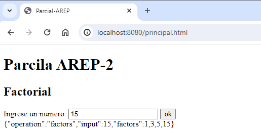
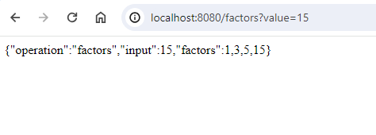
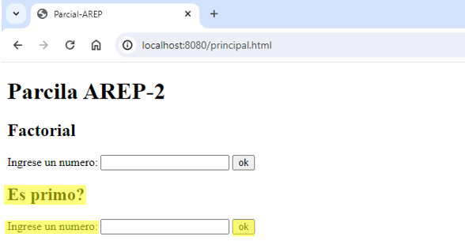
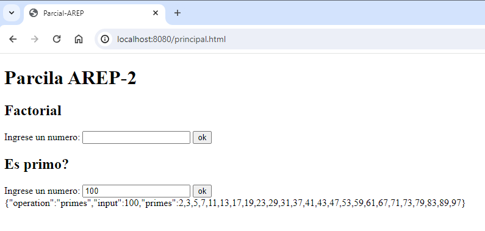
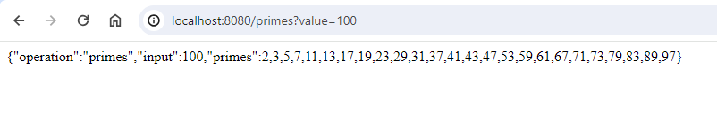

# Parcial AREP - 2

Se diseño y desplego una aplicación web que está compuesta por dos formularios:
•	Uno que calcula los números hasta un numero dado (n)
•	Y otro que calcula los factores de un numero (n)
Ambos reciben y dan numero enteros positivo. El programa esta desplegado en aws en tres maquinas virtuales de EC2.
# Prerequisitos
* Maven
* Java 17
* Git
# Como correrlo
1. Clonar el repositorio

```
git clone https://github.com/AREP-2024/Parcial2.git
```
2. moverse a la carpeta
```
cd parcial2
```
3. compilar el programa
```
mvn package
```
4. ejecute el programa con 
```
mvn exec:java -"Dexec.mainClass"="edu.escuelaing.arep.ase.app.App"
```
# ¿Cómo usarlo?
una vez ejecutado los comando de arriba  vaya al navegador de su preferencia y escriba la siguinte url:

```
http://localhost:8080/principal.html
```
Allí se le abrirá el siguiente formulario 


Este formulario nos ofrece dos funcionalidades las cuales son calcular los factores de un número y calcular los números primos hasta un número dado.

**Factores**

Si usted desea sacar los factoriales de un número use el primer formulario, para esto, escriba el número en la caja de texto y de clic en el botón que se encuentra al lado de esta.


Para este ejemplo vamos a hacer el factorial del número 15, al dar click sobre el boton “ok” el formulario le devolvera la respuesta en un formato js. Como se observa en la siguiente imagen: 


**Nota:** También podemos calcular los factores de un número mediante la url, para esto ingrese la siguiente dirección en su browser, poniendo después del **=** el número al que desea calcularle los factores. 
```
http://localhost:8080/factors?value=numero
```
En este caso vamos a usar el número 15 como se puede observar en la imagen:
```
http://localhost:8080/factors?value=15
```



**Primos**

Si usted desea sacar los primos hasta un numero dado use el segundo formulario, escriba el número en la caja de texto y de clic en el botón que se encuentra al lado de esta.


Para este ejemplo vamos sacar los numeros primos hasta 100, al dar click sobre el boton “ok” el formulario le devolvera la respuesta en un formato js. Como se observa en la siguiente imagen: 


**Nota:** También podemos calcular los primos hasta el número dado mediante la url, para esto ingrese la siguiente dirección en su browser, poniendo después del **=** el número hasta el que desea calcular los primos.  
```
http://localhost:8080/primes?value=numero
```
En este caso vamos a usar el número 100 como se puede observar en la imagen:
```
http://localhost:8080/primes?value=100
```



# Autores
Luisa Fernanda Bermudez Giron
# Lincencias
Luisa Fernanda Bermudez Giron