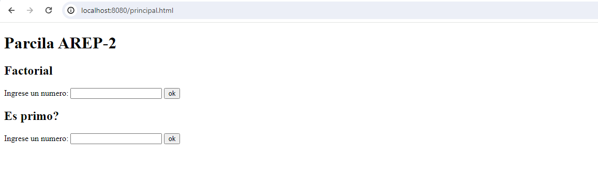
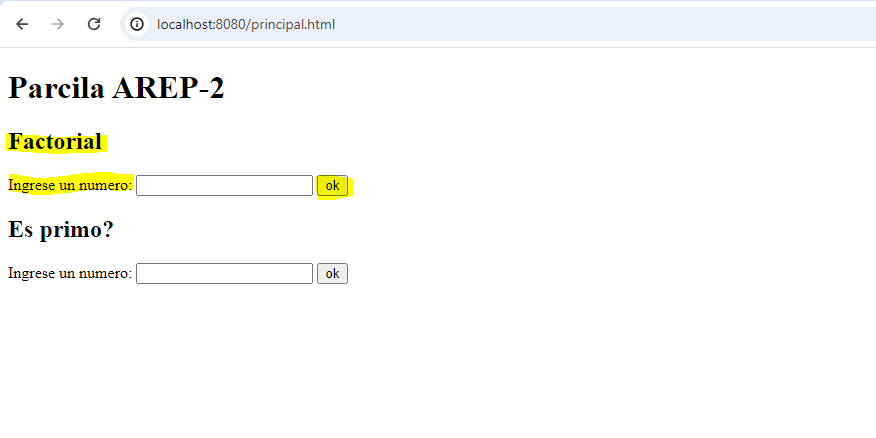

# Parcial AREP - 2

Se diseño y desplego una aplicación web que está compuesta por dos formularios:
•	Uno que calcula los números hasta un numero dado (n)
•	Y otro que calcula los factores de un numero (n)
Ambos reciben y dan numero enteros positivo. El programa esta desplegado en aws en tres maquinas virtuales de EC2.
# Prerequisitos
* Maven
* Java 8
* Git
# Como correrlo
1. Clonar el repositorio

```
git clone https://github.com/AREP-2024/Parcial2.git
```
2. moverse a la carpeta
```
cd parcial2
```
3. compilar el programa
```
mvn package
```
4. ejecute el programa con 
```
mvn exec:java -"Dexec.mainClass"="edu.escuelaing.arep.app.APP"
```
# ¿Cómo usarlo?
una vez ejecutado los comando de arriba  vaya al navegador de su preferencia y escriba la siguinte url:

```
http://localhost:8080/principal.html
```
Allí se le abrirá el siguiente formulario 

Si usted desea sacar la factorial de un numero use el primer formulario, escriba el numero la la caja de texto y de clic en el botón que se encuentra al lado de esta.

Para este ejemplo vamos a hacer el factorial del numero 15, al dar click sobre el boton “ok” el formulario le devolvera la respuesta en un formato js. 


# Autores
Luisa Fernanda Bermudez Giron
# Lincencias
Luisa Fernanda Bermudez Giron