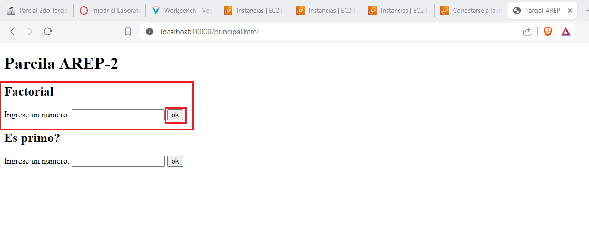
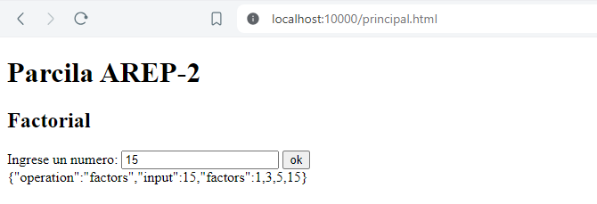
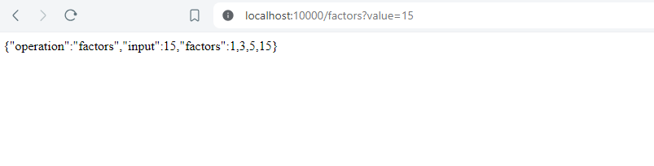
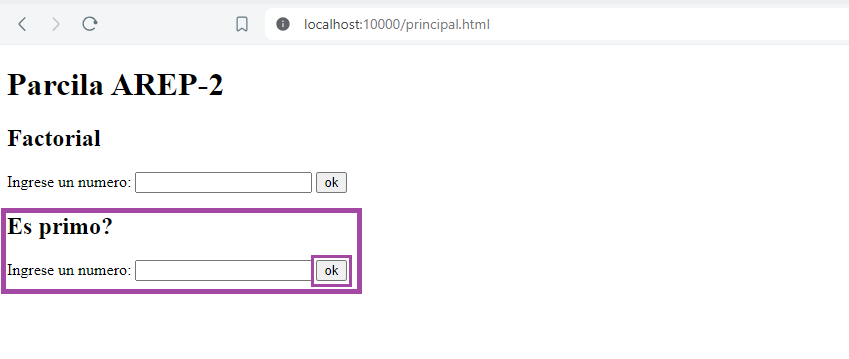
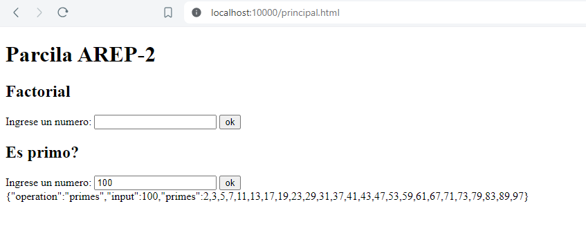
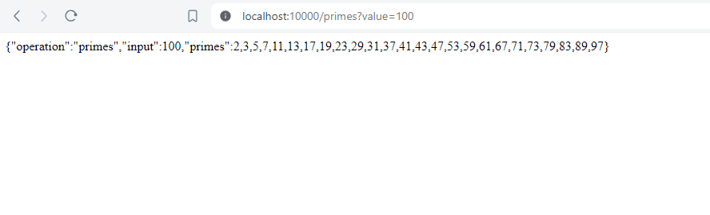
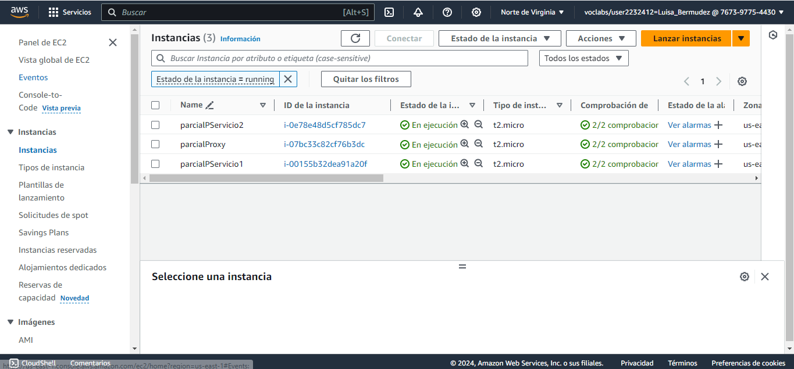

# Parcial AREP - 2

Se diseño y desplego una aplicación web que está compuesta por dos formularios:
•	Uno que calcula los números hasta un numero dado (n)
•	Y otro que calcula los factores de un numero (n)
Ambos reciben y dan numero enteros positivo. El programa esta desplegado en aws en tres maquinas virtuales de EC2.

# Prerequisitos

* Maven
* Java 17
* Git

# Instalación y Ejecución

1. Clonar el repositorio

```
git clone https://github.com/AREP-2024/Parcial2.git
```

2. Moverse a la carpeta principal del proyecto:

```
cd Parcial2
```

**Nota:** Para la ejecución de este proyecto necesitaremos tener dos consolas abiertas que se encuentren en la carpeta principal del proyecto, es decir, en Parcial2:

3. En una de las consolas nos vamos a mover a la carpeta servicio con el siguiente comando:

```
cd servicio
```

* Compilamos ese microservicio con el siguiente comando:

```
mvn package
```

* Y se corre el microservicio de servicio con:

```
mvn exec:java -"Dexec.mainClass"="edu.escuelaing.arep.ase.app.App"
```

4. Nos dirigimos a la siguiente consola donde vamos a movernos a la carpeta proxy:

```
cd proxy
```

* Antes de compilar este microservicio debemos configurar las variables de entorno:

```
$env:MATH_HOST_1="http://localhost"
$env:MATH_HOST_2="http://localhost"
$env:MATH_PORT_1=8080
$env:MATH_PORT_2=8080
```

**Nota:** Usted puede verificar el valor de las variables de entorno con los siguientes comando:

```
echo $env:MATH_HOST_1
echo $env:MATH_HOST_2
echo $env:MATH_PORT_1
echo $env:MATH_PORT_2
```

* Una vez configuradas las variables de entrono pones a correr el microservicio **proxy** con el siguiente comando:

```
mvn exec:java -"Dexec.mainClass"="edu.escuelaing.arep.ase.app.Main"
```

**Nota:** Antes de validar el funcionamiento verifique ambos microservicios se estén ejecutando. 

# ¿Cómo usarlo?
una vez ejecutado los comando de arriba  vaya al navegador de su preferencia y escriba la siguinte url:

```
http://localhost:10000/principal.html
```
Allí se le abrirá el siguiente formulario 


Este formulario nos ofrece dos funcionalidades las cuales son calcular los factores de un número y calcular los números primos hasta un número dado.

**Factores**

Si usted desea sacar los factoriales de un número use el primer formulario, para esto, escriba el número en la caja de texto y de clic en el botón que se encuentra al lado de esta.


Para este ejemplo vamos a hacer el factorial del número 15, al dar click sobre el boton “ok” el formulario le devolvera la respuesta en un formato js. Como se observa en la siguiente imagen: 


**Nota:** También podemos calcular los factores de un número mediante la url, para esto ingrese la siguiente dirección en su browser, poniendo después del **=** el número al que desea calcularle los factores. 
```
http://localhost:10000/factors?value=numero
```
En este caso vamos a usar el número 15 como se puede observar en la imagen:
```
http://localhost:10000/factors?value=15
```



**Primos**

Si usted desea sacar los primos hasta un numero dado use el segundo formulario, escriba el número en la caja de texto y de clic en el botón que se encuentra al lado de esta.


Para este ejemplo vamos sacar los numeros primos hasta 100, al dar click sobre el boton “ok” el formulario le devolvera la respuesta en un formato js. Como se observa en la siguiente imagen: 


**Nota:** También podemos calcular los primos hasta el número dado mediante la url, para esto ingrese la siguiente dirección en su browser, poniendo después del **=** el número hasta el que desea calcular los primos.  
```
http://localhost:10000/primes?value=numero
```
En este caso vamos a usar el número 100 como se puede observar en la imagen:
```
http://localhost:10000/primes?value=100
```


# Despliegue en AWS

Se crearon tres instancias en EC2
1. parcialProxy
2. parcialPServicio1
3. parcialPServicio2
 
Como se observa en la siguiente imagen:


La instalación y ejecución del proyecto es similar a la mencionada anteriormente, con la diferencia de que la declaración de las variables de entorno en la instancia del proxy se realiza de la siguiente manera:

```
export MATH_HOST_1="http://localhost"
export MATH_HOST_2="http://localhost"
export MATH_PORT_1=8080
export MATH_PORT_2=8080
```

Para verificar el valor de cada una de las variables puede usar los siguientes comandos: 

```
echo $MATH_HOST_1
echo $MATH_HOST_2
echo $MATH_PORT_1
echo $MATH_PORT_2
```
En el siguiente enlace usted podrá ver el video con el respectivo despliegue en aws:
```
```

## Autor
[Luisa Fernanda Bermudez Giron](https://www.linkedin.com/in/luisa-fernanda-bermudez-giron-b84001262/) - [Luisa Fernanda Bermudez Giron](https://github.com/LuisaGiron)

## Licencia 
**©** Luisa Fernanda Bermudez Giron, Estudiante de Ingeniería de Sistemas de la Escuela Colombiana de Ingeniería Julio Garavito.